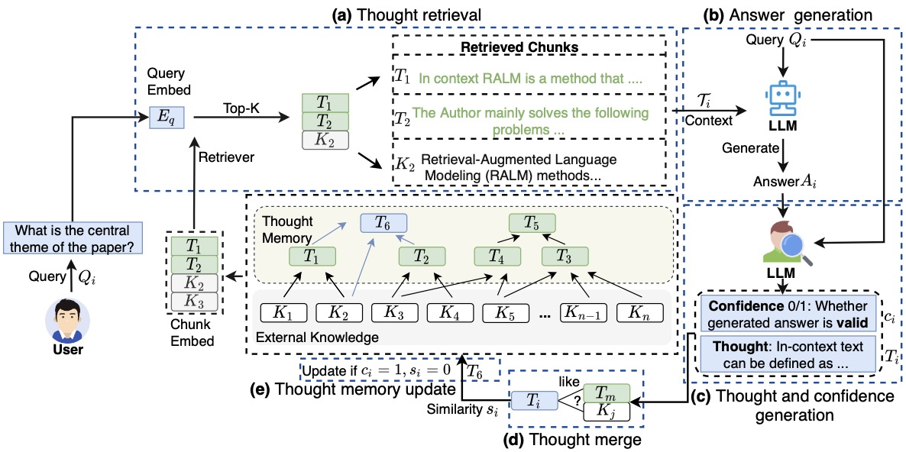

# Thought-Retriever: Don’t Just Retrieve Raw Data, Retrieve Thoughts

<p align="center">
    <a href="https://ulab-uiuc.github.io/GraphRouter/">
        
    </a>
    <a href="http://arxiv.org/abs/2410.03834">
        
    </a>
    <a href="https://x.com/taofeng_uiuc/status/1914914682860695559">
        
    </a>
    <a href="https://github.com/ulab-uiuc/GraphRouter/blob/master/LICENSE">
        
    </a>
    <br>
    <a href="https://github.com/ulab-uiuc/GraphRouter">
        
    </a>
    <a href="https://github.com/ulab-uiuc/GraphRouter">
        
    </a>
    <a href="https://github.com/ulab-uiuc/GraphRouter">
        
    </a>
</p>


<p align="center">
    <a href="https://ulab-uiuc.github.io/GraphRouter/">🌐 Project Page</a> |
    <a href="http://arxiv.org/abs/2410.03834">📜 arXiv</a> |
    <a href="https://x.com/taofeng_uiuc/status/1914914682860695559">📮 Twitter Post</a>
<p>


<!--  -->

<div align="center">
  
</div>


**[2024.06.22]** 🌟 **Thought-Retriever** is accepted for ICLR 2024 Workshop.


## 📌Preliminary


### Environment Setup

```shell
# create a new environment
conda create -n thought-retriever python=3.10
conda activate thought-retriever

# install pytorch. Modify the command to match your CUDA version
pip install torch==1.12.1+cu113 torchvision==0.13.1+cu113 torchaudio==0.12.1 \
  --extra-index-url https://download.pytorch.org/whl/cu113

# install related libraries
pip install -r requirements.txt

```

### Dataset Preparation

[QMSum](https://github.com/Yale-LILY/QMSum)
[WCEP](https://huggingface.co/datasets/ccdv/WCEP-10)
[Booksum](https://huggingface.co/datasets/kmfoda/booksum)
[GovReport](https://huggingface.co/datasets/ccdv/govreport-summarization/tree/refs%2Fconvert%2Fparquet/document)
[SQuALITY](https://github.com/nyu-mll/SQuALITY)


Save the downloaded files in the `./data/[DATASET_NAME]` folder.

### Generate Pre-queries

You can generate pre-queries using the following code:

```bash
python pre_query_generator.py \
    --root DATA_PATH \
    --api_base YOUR_API_BASE \
    --api_key YOUR_API_KEY \
    --dataset_type related_multi \
    --chunk_size 500 \
    --feat_cross \
    --with_doct5query \
    --device 0
```

## ⭐Experiments


### Run thought-retriever and Metric Evaluation


You can follow this example:

```bash
python run_experiment.py \
  --root DATA_PATH \
  --api_base YOUR_API_BASE \
  --api_key YOUR_API_KEY \
  --llm_model YOUR_MODEL \
  --cuda 0 \
  --chunk_num 8 \
  --recall_coe 5 \
  --sim_thre 0.85

```
### Evaluation using LLM-as-a-Judge

Evaluate the answers generated by thought-retriever through this:

```bash
python llm_evaluation.py \
  --api_base YOUR_API_BASE \
  --api_key YOUR_API_KEY \
  --llm_model YOUR_MODEL \
  --seed 42 \
  --tau 0

```

## Citation

```bibtex
@article{feng2024thought,
  title={Thought-retriever: Don’t just retrieve raw data, retrieve thoughts},
  author={Feng, Tao and Han, Pengrui and Lin, Guanyu and Liu, Ge and You, Jiaxuan},
  year={2024}
}
```


<!-- <picture>
<source media="(prefers-color-scheme: dark)" srcset="https://api.star-history.com/svg?repos=ulab-uiuc%2FGraphEval&theme=dark&type=Date">

</picture> -->
